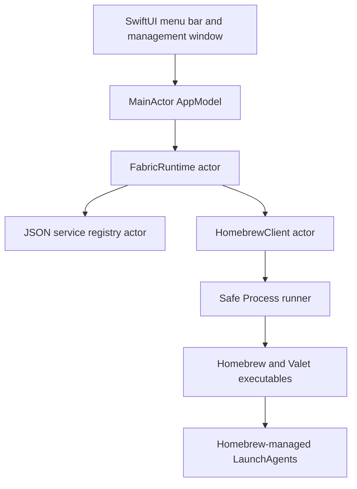
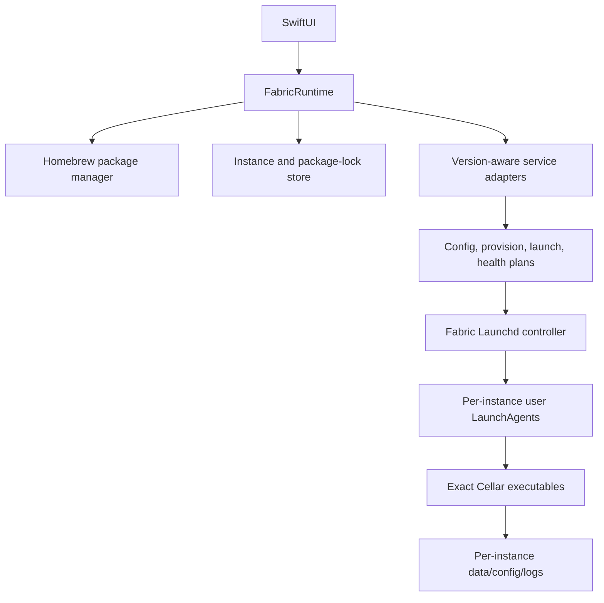

# Fabric Architecture

## Current release (`0.1.0`)



The current release is an intentionally limited bridge over `brew services`:

1. The Add Service sheet reads the local Homebrew formula catalog.
2. Fabric installs a selected formula if needed.
3. Fabric pins the formula and records the resolved installed version.
4. Fabric registers the service in its JSON registry.
5. Start/Stop/Restart invoke `brew services` with an argument array.
6. Status is read in one batch from `brew services list --json`.
7. Logs are discovered from the generated LaunchAgent plist when paths are available.

This design provides a working, safe foundation but cannot run arbitrary duplicate instances. Homebrew generally creates one service label per formula.

## Target multi-instance runtime



The architectural rule is:

> Homebrew owns packages; Fabric owns isolated instances; launchd owns process lifetime; adapters own service semantics.

### Package and instance separation

A `PackageLock` records:

- full Homebrew formula name;
- installed version;
- exact Cellar keg path when available;
- whether a pin was pre-existing or created by Fabric;
- lock timestamp.

A `ServiceInstance` records:

- stable UUID;
- user-visible name;
- service family and source;
- package lock;
- one or more named loopback endpoints;
- creation timestamp.

Ports never identify an instance. Mailpit, Caddy, and RustFS demonstrate why one instance can require multiple ports.

### Adapter boundary

Each service adapter will declare rather than directly execute:

- accepted formula identities and binary versions;
- provisioning and initialization steps;
- typed configuration rendering;
- exact foreground executable and arguments;
- environment and working directory;
- named endpoint requirements;
- readiness and health checks;
- graceful shutdown behavior;
- log locations and redaction policy;
- data/upgrade compatibility constraints.

MySQL and MariaDB remain separate adapters because initialization, authentication, executable names, and config compatibility diverge. Redis and Valkey may share helpers but retain separate compatibility contracts.

## Filesystem layout

```text
~/Library/Application Support/Exnano Fabric/
├── services.json
└── Instances/<uuid>/
    ├── instance.json        # planned per-instance manifest
    ├── config/
    ├── data/
    └── backups/

~/Library/Logs/Exnano Fabric/<uuid>/
├── stdout.log
└── stderr.log

~/Library/LaunchAgents/
└── com.exnano.fabric.<service>.<short-id>.plist
```

Registry writes are atomic. Application Support/instance directories should use mode `0700`; sensitive files should use `0600`. Secrets belong in Keychain rather than JSON or LaunchAgent environment variables.

## Process safety

- Execute only trusted absolute executable URLs.
- Pass each argument separately; never invoke `/bin/sh -c`.
- Bound command output and execution time.
- Bind managed services to loopback by default.
- Never invoke Homebrew with `sudo`.
- Never run `brew update` as a side effect of opening Fabric.
- Never add a third-party tap silently.
- Validate the exact keg and binary version before each Fabric-owned instance starts.
- Treat port checks as advisory and verify readiness after launch.

## Persistence and concurrency

- `AppModel` is `@MainActor` and contains only UI-facing state.
- `FabricRuntime`, Homebrew management, and JSON persistence are actors.
- Domain values are immutable `Codable`, `Hashable`, and `Sendable` structs/enums.
- The persistence schema version is independent from app SemVer.
- Long-running Homebrew work never blocks the main actor.

## Distribution

Fabric is a poor fit for the Mac App Store sandbox because it must execute local package-manager binaries and manage user LaunchAgents. The planned distribution model is a Developer ID-signed, hardened, notarized app. A privileged helper is not required for user services and should be added only if a future, explicit root-owned use case justifies it.
